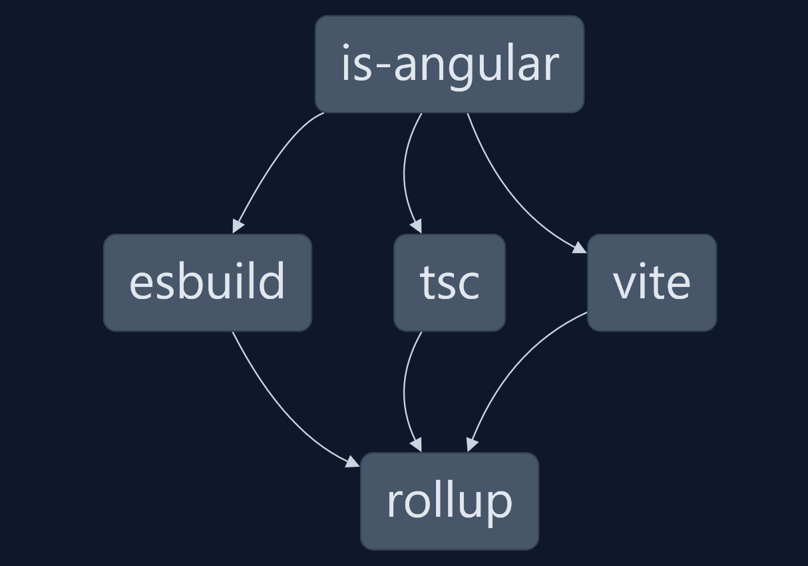
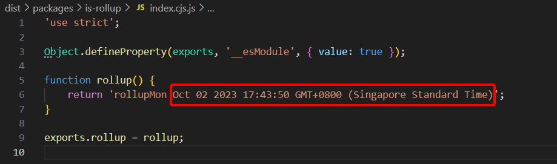
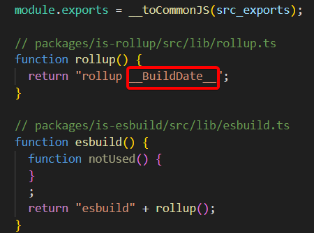
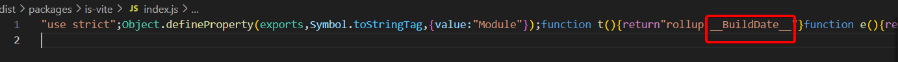
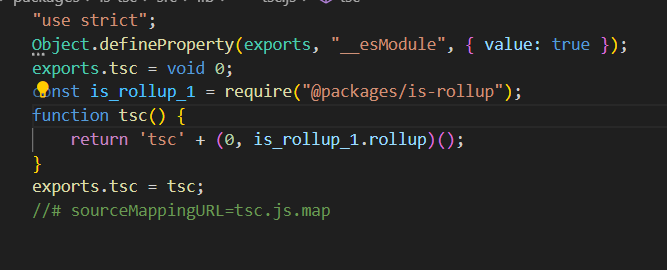
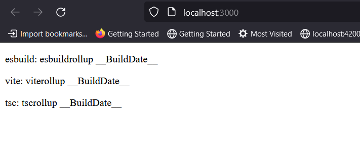

# A Repository About Bundling Issues in Nx

I wanted to prove that nx doesn't use its build result. meaning that builds doesn't do anything with each other and you are transpiling the same file again and again with typescript compiler. 

## How This Project Is Organized:

There is an Angular project named "is-angular", and there are four packages: `esbuild`, `vite`, `tsc`, and `rollup`.

All packages have a dependency on `rollup`, and `rollup` is customized with a plugin to ensure that none of these packages use the actual .ts file in the repo. instead I'm seeking to prove build usage as part of package/app bundling and transpilation.

Unfortunately, it turned out that the dist folder in nx has no use. As a result of this test some questions arise, such as:

1. The memory and load on each package/app build. Instead of a one-time build and many-time use, each usage graph is loaded by each builder.
2. Can we benefit from faster bundlers like `esbuild` in combination with legacy bundlers like Webpack? Webpack runs its own set of optimizations, and `esbuild` does its own transpiling. The result and performance of each don't affect one another as each one handles its own transpilation.
3. What exactly does nx caching do when each of the builder load the whole nx project on their own?
4. Some commands like `ng serve` become much slower in Nx as a result of how all the packages need to be loaded into Webpack, instead of the result of each package being loaded individually.

## How to Test:

Run `nx build is-angular --skip-nx-cache`. This will build all four packages. Let's then view the `dist` folder and dissect each one.

Let's start with the packages:

#### Rollup

This is the package that every other package depends on and has a plugin to replace build date time. If you check `dist\packages\is-rollup\index.cjs.js`, you can see that it works well.

#### Esbuild

If we check the Esbuild dist folder in `dist\packages\is-esbuild\index.cjs`, we can see that it didn't use the result of the RollUp bundler and instead bundled it with Esbuild.

#### Vite

If we check the Vite dist folder in `dist\packages\is-vite\index.js`, we can see that it didn't use the result of the RollUp bundler and instead bundled it with vite.

#### TSC

It's hard to tell because TSC requires a package.

#### Angular

If we go to `dist\apps\is-angular` and type `(p)npx serve`, we can see that Angular also didn't use Nx build result.

